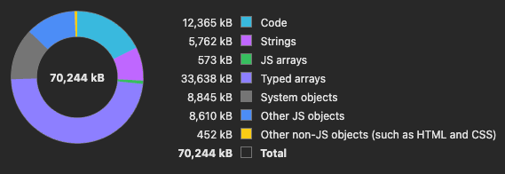
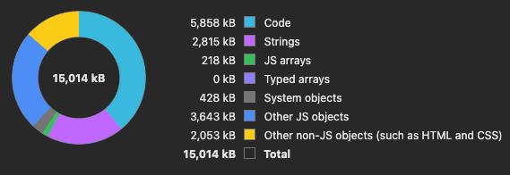
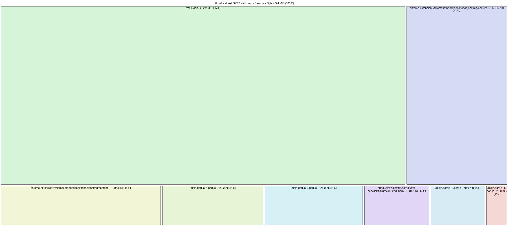
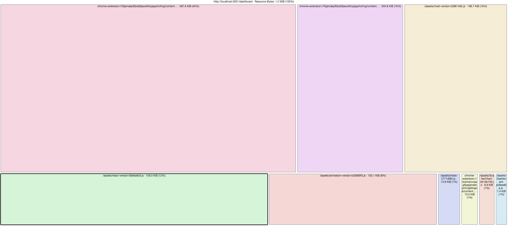

# Benchmark : Performance et Fluidité - Flutter Web vs ReactJS

## Objectif

Ce benchmark vise à comparer de façon objective et rigoureuse les performances réelles de Flutter Web et ReactJS à
travers un projet unique, réaliste, interactif et complexe. Nous souhaitons déterminer les forces et les limites de
chaque technologie en minimisant l'impact des outils extérieurs afin d'obtenir une mesure précise et équitable de leur
capacité intrinsèque.

## Projet de référence : Plateforme Interactive de Visualisation de Données

### **Description du Projet**

Le projet choisi pour cette comparaison est une application web représentant un tableau de bord interactif en temps
réel, permettant la visualisation dynamique de données actualisées fréquemment. Ce choix est motivé par l'exigence
élevée en fluidité, réactivité et performances graphiques nécessaires à ce type d'application, ce qui en fait un
excellent candidat pour révéler les forces et les faiblesses de Flutter Web et ReactJS.

### Caractéristiques du projet :

- **Tableau de bord interactif** affichant des graphiques dynamiques (histogrammes, courbes, jauges).
- **Navigation dynamique** avec transitions et animations fluides (menus, accordéons, onglets animés).
- **Gestion intensive des événements utilisateur** (clic, scroll, zoom interactif sur les graphiques).
- **Mise à jour en temps réel** des données simulée localement pour garantir une indépendance vis-à-vis de sources
  externes.

## Méthodologie de Benchmark

### Critères évalués :

- **Temps de chargement initial** (FCP - First Contentful Paint)
- **Temps avant interactivité complète** (TTI - Time To Interactive)
- **Fluidité et réactivité** (FPS moyen lors des animations intensives)
- **Consommation CPU et mémoire** en scénarios interactifs intenses
- **Accessibilité intrinsèque** (capacité à intégrer des balises sémantiques et interactions clavier)
- **Capacité intrinsèque d'optimisation SEO** (structure HTML ou équivalente générée)

### Outils utilisés :

- **Lighthouse** et **PageSpeed Insights** : Analyse du chargement et fluidité.
- **Chrome DevTools** : Profilage CPU, mémoire et analyse des FPS.

## Plan de Développement et Tests

1. **Développement initial** :
    - Mise en place d'une architecture minimale équivalente dans les deux technologies.
    - Intégration des graphiques interactifs :
        - **Flutter Web** : utilisation de `fl_chart`.
        - **ReactJS** : utilisation de `Chart.js`.

2. **Optimisation intrinsèque** :
    - Implémentation du lazy loading des modules et des composants graphiques.
    - Optimisation du cycle de rendu (minimiser les re-rendus inutiles).
    - Optimisation locale des images et ressources (compression, formats adaptés).

2. **Simulation de mise à jour de données temps réel** :
    - Mise à jour régulière et intensive des données (simulation locale avec timer intégré).
    - Mesure de la fluidité (FPS) et réactivité lors d'une interaction utilisateur soutenue.

3. **Tests comparatifs approfondis** :
    - Mesure systématique des métriques sur chaque implémentation.
    - Documentation des résultats précis (temps de chargement, FCP, TTI, FPS, mémoire).

## Résultats Obtenus

| Métrique                       | Flutter Web | ReactJS  |
|--------------------------------|-------------|----------|
| Temps de chargement initial    | ~1.08 s     | ~1.06 s  |
| First Contentful Paint (FCP)   | ~0.3 s      | ~0.6 s   |
| Speed Index                    | ~0.8 s      | ~1.2 s   |
| Total Blocking Time            | 60 ms       | 0 ms     |
| Fluidité des animatyions (FPS) | ~120 FPS    | ~120 FPS |
| Consommation mémoire moyenne   | ~30 Mo      | ~18 Mo   |
| Taille totale des bundles      | ~3.4 Mo     | ~1.2 Mo  |

### Détails sur la consommation mémoire

#### Flutter Web

- **Code (14 310 kB)** : Il s’agit du code Dart compilé en JavaScript ou en WebAssembly (selon la configuration) et des librairies associées.
- **Strings (5 930 kB)** : Les chaînes de caractères utilisées par l’appli Flutter.
- **JS Arrays (584 kB)** : Les tableaux JavaScript “classiques”, nettement moins présents que dans une appli React.
- **Typed Arrays (33 638 kB)** : Très important : près de la moitié de la mémoire totale.
- **System Objects (8 060 kB)** : Objets internes au moteur JS (V8).
- **Other JS Objects (9 066 kB)** : Objets divers de l’application, logiques internes de Flutter.
- **Other non-JS objects (628 kB)** : Probablement du HTML minimal, CSS ou autres éléments de runtime nécessaires.

Il s'agit là de la mémoire réservée, non celle utilisée.

#### ReactJS

- **Code (5 104 kB)** : Il s’agit du JavaScript interprété (et éventuellement minifié) qui correspond à l’application et à ses dépendances.
- **Strings (3 151 kB)** : Il s’agit des chaînes de caractères (textes, identifiants, etc.) manipulées par l’application.
- **JS Arrays (202 kB)** : Les tableaux JavaScript “classiques” (Array).
- **Typed Arrays (0 kB)** : Absence totale ou quasi-nulle de tableaux typés.
- **System Objects (560 kB)** : Objets bas-niveau gérés par le moteur JavaScript (V8 dans Chrome).
- **Other JS Objects (4 668 kB)** : La majorité des objets React, du DOM virtuel, des composants, etc.
- **Other non-JS objects (2 127 kB)** : Cela peut inclure des éléments HTML, CSS en mémoire ou d’autres structures de rendu.

#### Qu’est-ce qu’un *Typed Array* ?

Les *Typed Arrays* (ou *tableaux typés*) sont une spécification du langage JavaScript permettant de manipuler des données binaires brutes (raw binary data) de manière efficace. Contrairement aux tableaux JavaScript ordinaires (Array), dont la taille et le type peuvent fluctuer librement, les *Typed Arrays* reposent sur des buffers mémoires fixes et typés (par exemple `Int8Array`, `Float32Array`, `Uint8ClampedArray`, etc.).

Concrètement, cela signifie que lorsque l’on crée un *Typed Array* de taille 1024 avec un type 32 bits, on sait exactement combien d’octets sont réservés et comment ils sont structurés. C’est idéal pour :
- La manipulation de gros volumes de données binaires (images, sons, flux vidéo, etc.).
- Les calculs mathématiques intensifs, où le typage statique et l’accès mémoire direct procurent de meilleures performances.
- Les moteurs de rendu ou jeux qui nécessitent d’écrire et de lire rapidement dans un tampon mémoire.

Pourquoi Flutter utilise massivement les *Typed Arrays* ?

Contrairement à ReactJS, qui s’appuie principalement sur le DOM du navigateur et le moteur de rendu existant, Flutter (y compris sur le Web) embarque une bonne partie de son propre moteur de rendu (un peu comme un mini moteur de jeu). Pour afficher les widgets, gérer la couche graphique et animer l’interface, Flutter utilise des buffers mémoires où sont stockées et manipulées les données graphiques.
- Ce moteur a besoin de *Typed Arrays* pour gérer efficacement la mémoire et exécuter les calculs graphiques (transformations, animations, etc.).
- Les *Typed Arrays* permettent un accès plus rapide et prévisible à la mémoire qu’un tableau JavaScript classique.
- Le framework Flutter gère une hiérarchie de widgets, le calcul de layout et toutes les transitions au sein de sa propre couche. Toutes ces informations (positions, dimensions, styles, etc.) sont très souvent stockées dans des buffers spécialisés afin de pouvoir être traitées rapidement par l’algorithme de rendu.

ReactJS, dans sa philosophie, s’appuie avant tout sur :
- Le DOM virtuel (Virtual DOM), implémenté sous forme de simples objets JavaScript et de `diffing` algorithmes.
- Les structures de données JavaScript habituelles (Array, Object, etc.).
- Le navigateur pour le rendu final (HTML/CSS), plutôt qu’un moteur de rendu interne.

De fait, ReactJS n’a pas besoin de gérer directement de gros blocs de données binaires : c’est le navigateur qui s’en charge lorsqu’il parse du HTML, applique du CSS ou manipule le GPU via le moteur de rendu. React ne fait que piloter ces changements via du JavaScript “classique”.

### Détails sur la taille des bundles

#### Flutter

#### ReactJS

#### Analyse des Bundles

Flutter : un framework complet avec moteur de rendu
* Inclusion du moteur de rendu : Contrairement à React, Flutter Web embarque sa propre couche de rendu graphique. Autrement dit, le code Dart compilé comprend une partie “moteur” (similaire à un mini moteur de jeu) pour dessiner directement sur un canvas HTML, sans se reposer sur le DOM pour le layout et le rendu.
* Runtime et librairies Dart : Le bundle contient également la machine virtuelle Dart compilée en JavaScript ou en WebAssembly, ainsi qu’un ensemble de bibliothèques standard et spécifiques à Flutter (widgets, animations, etc.).
* Overhead initial : Cela crée un “socle” plus lourd, même pour des applications relativement simples.

React : une librairie UI s’appuyant sur le DOM
* Dépendance au navigateur : React n’embarque pas de moteur de rendu à proprement parler ; il s’appuie sur le DOM, le CSS, et les APIs natives du navigateur pour afficher l’interface.
* Léger par défaut : Le cœur de React est assez concis (quelques centaines de kilo-octets au maximum), et l’on ajoute ensuite d’autres bibliothèques (React Router, Redux, etc.) au besoin.
* Bundle modulaire : Les outils comme Webpack ou Vite permettent de regrouper uniquement les dépendances réellement utilisées, ce qui réduit la taille finale.

Projection pour de grosses applications web

Évolution des tailles
* Flutter : La taille du socle (moteur + runtime) reste sensiblement la même, quelle que soit la taille de l’application. En revanche, les widgets et fonctionnalités supplémentaires vont certes accroître la taille, mais le “gros bloc” initial demeure le facteur principal.
* React : La croissance du bundle est plus progressive. On commence léger, puis on ajoute au fur et à mesure des bibliothèques et des composants. Plus l’application est volumineuse, plus on a de dépendances, et la taille peut alors s’approcher voire dépasser celle d’une appli Flutter — mais cela dépendra largement du choix des librairies et du niveau de factorisation du code.

En résumé, la différence de ~2 Mo (3,4 Mo pour Flutter contre 1,2 Mo pour React) provient essentiellement de la présence du moteur de rendu et du runtime Dart côté Flutter. Dans des projets de grande envergure, l’overhead initial sera vite relativisé.
Dans les deux cas, utiliser le lazy loading et la séparation des bundles (splitting) permettra de limiter l’impact de ces tailles sur le temps de chargement initial.

## Conclusion et Perspectives

Les résultats du benchmark démontrent que, globalement, Flutter Web et ReactJS offrent des performances très comparables pour la majorité des projets.

- **Temps de chargement initial :** Les deux frameworks se situent autour de 1,08 s pour Flutter Web et 1,06 s pour ReactJS, indiquant une réactivité similaire dès le lancement de l'application.
- **Première peinture du contenu (FCP) et Speed Index :** Flutter Web affiche un avantage avec un FCP à environ 0,3 s et un Speed Index à 0,8 s, contre 0,6 s et 1,2 s pour ReactJS. Ces différences suggèrent que Flutter pourrait offrir une première impression légèrement plus rapide, même si l'impact sur l'expérience globale reste modeste.
- **Temps de blocage total et consommation mémoire :** ReactJS se distingue par un Total Blocking Time nul et une consommation mémoire moindre (~18 Mo contre ~30 Mo pour Flutter Web). Ces aspects peuvent être avantageux dans des environnements où la gestion des ressources est cruciale.
- **Fluidité des animations :** Les deux technologies offrent une fluidité d'animation équivalente (~120 FPS), garantissant une expérience visuelle fluide pour l'utilisateur.

En conclusion, même si Flutter Web présente quelques avantages en termes de rapidité de rendu initial, et ReactJS montre une meilleure gestion des ressources, ces différences demeurent relativement mineures. Pour la majorité des projets, les performances des deux frameworks sont globalement équivalentes et le choix entre l’un ou l’autre pourra être principalement orienté par des critères fonctionnels ou de préférences en termes de développement plutôt que par une disparité notable des performances.

Bien que ce benchmark limite volontairement les outils extérieurs pour se concentrer sur les capacités intrinsèques de
Flutter Web et ReactJS, il est possible d'envisager à terme des compléments tels que :

- **Flutter Web** : utilisation de compilation WebAssembly (WASM) et pré-rendu statique.
- **ReactJS** : intégration de solutions comme NextJS pour le Server Side Rendering (SSR).
